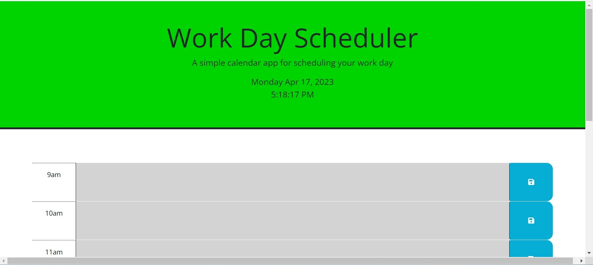
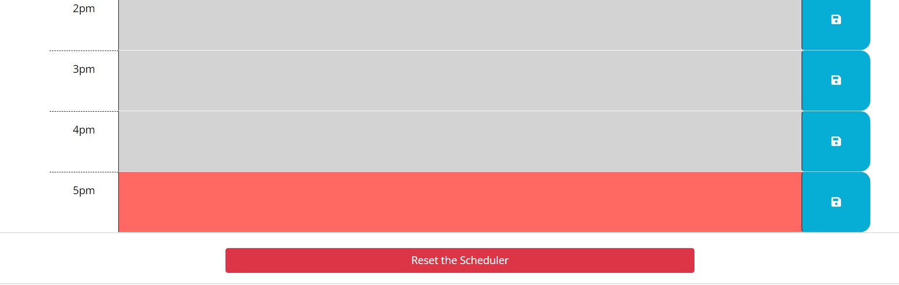
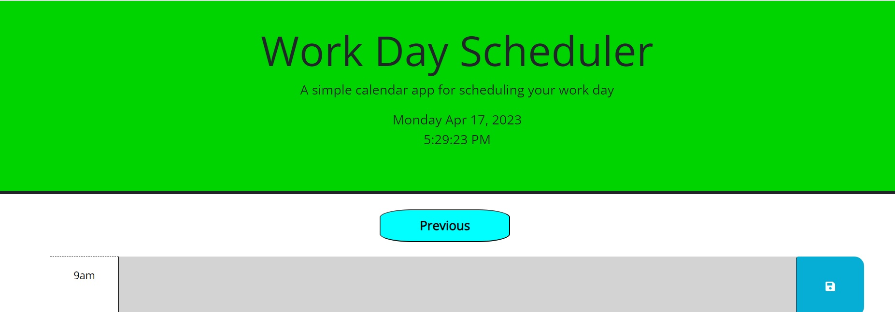
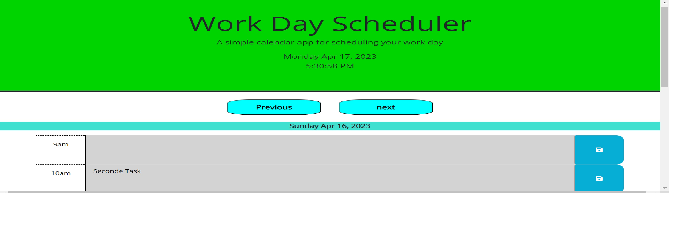

# Work-Day-Scheduler

## Description
This is an online Scheduler that allow you to shedual your day with tasks at certain time for each task.

## Installation

N/A

## Usage

To use this scheduler, just write the task discription that you want to do in the text area beside the time when you want that task to be done.
The tasks will appear in deffernt colors, Gray: which means this task is in the past, Red: which mean the curent task and Green which mean the task is in the future.
once the working hours are done (between 9 am and 5 pm), at 6 pm the current tasks will be removed frmo the screen and send to the archive so you can see the tasks that you did in the past by clicking on the Previous button wich will allow you to go the past days tasks day after day and buy using the next button you can go back the current day schedual.
The Previous button will appear after the first day get archived and the Next button will appear when press the Previous button and will disappear when you go back to todays tasks.
If you want to clear all the history of the days just scroll down to the end of the page and you will find 'Reset buttom' which will reset all the memory and remove the previous button which will appear again when the first day get archived.

## Assets
The following image demonstrates the web application's appearance and functionality:

## Credits

N/A

## License

Licensed under the [MIT](https://github.com/ghiasnaser/Code-Quiz/blob/315592c3736260e5954115980d90fff3a73112b7/LICENSE) license.

## Links
The website link:  https://ghiasnaser.github.io/Code-Quiz/
The repository link: https://github.com/ghiasnaser/Code-Quiz.git
